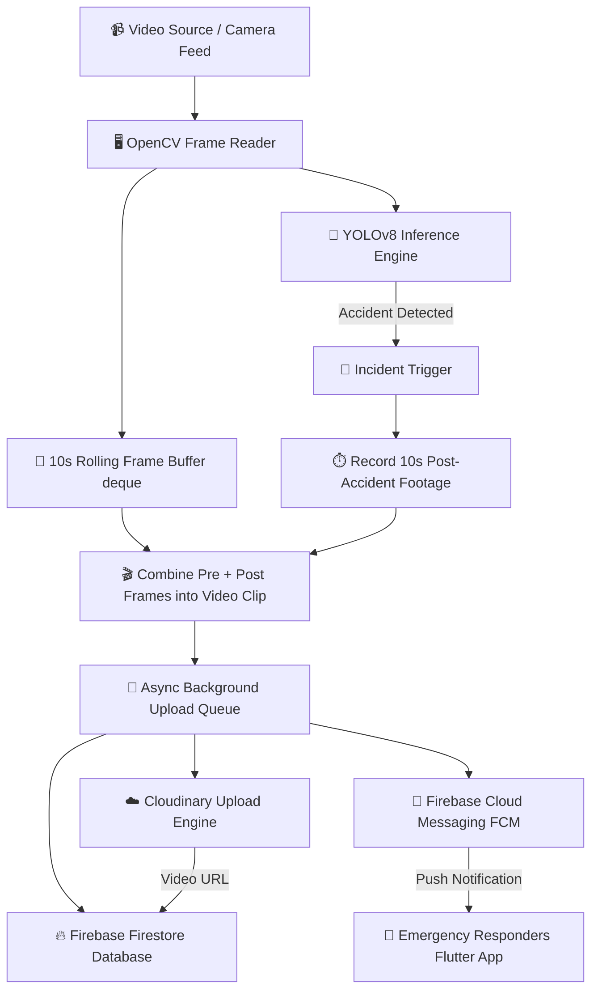

# 🚨 Crash Guard - Camera Panel

### _AI-Powered Traffic Camera Accident Detection & Alert System_

[](https://www.python.org/)
[](https://docs.ultralytics.com/)
[](https://pytorch.org/)
[](https://github.com/TomSchimansky/CustomTkinter)
[](https://firebase.google.com/)
[](https://cloudinary.com/)

---

## 📌 Project Overview

**Crash Guard** is an end-to-end intelligent traffic monitoring and accident detection platform designed to enhance road safety and minimize emergency response times.

The system consists of two primary interconnected components:

1. **Camera Panel (This Repository)**: A high-performance Python desktop application deployed on traffic camera monitoring nodes. It uses Computer Vision and Deep Learning (YOLOv8) to process live video feeds, detect vehicular accidents in real time, record evidence buffers, upload video clips to cloud storage, and trigger automated emergency alerts via Firebase Cloud Messaging (FCM).
2. **Management Panel (Separate Component)**: A cross-platform mobile and web application built with **Flutter** for traffic control rooms, emergency services, and administrators. It enables responders to view real-time incident reports, play evidence video clips, locate accidents on interactive maps, and track resolution status.

---

## 🏗️ System Architecture & Workflow

The Camera Panel continuously monitors traffic video feeds, maintains a rolling pre-accident buffer, captures post-accident footage, uploads encoded video clips asynchronously, and broadcasts FCM notifications to registered mobile/web clients.



---

## ✨ Key Features

- **Real-Time Accident Detection**: Powered by a custom-fine-tuned YOLOv8 deep learning model trained to detect vehicular collisions and categorize severity levels (`mild`, `moderate`, `severe`).
- **Dynamic Pre & Post Accident Capture**: Utilizes a circular ring buffer (`collections.deque`) to store 10 seconds of pre-accident footage prior to impact and automatically captures 10 seconds post-impact for comprehensive evidence.
- **Asynchronous Cloud Pipeline**: Built with Python multi-threading (`queue.Queue`) so video encoding, Cloudinary cloud uploads, and Firebase network calls execute smoothly in the background without freezing the live GUI feed.
- **Automated Cloud Storage**: Automatically renders `.mp4` video clips and uploads them to **Cloudinary** under organized project directories.
- **Real-Time Alerting System**:
  - Writes structured accident records (severity, confidence score, address, precise latitude & longitude, video URL, timestamp, status) directly to **Firebase Firestore**.
  - Dispatches instant **Firebase Cloud Messaging (FCM)** push notifications to emergency responders and administration apps.
- **Modern Dark-Themed GUI**: Built using **CustomTkinter** for an intuitive operator user experience featuring login authentication (camera address & geo-coordinates) and real-time bounding box video preview.
- **Detection Cooldown Engine**: Built-in anti-spam cooldown buffer to prevent duplicate alerts during continuous multi-vehicle incidents.

---

## 📁 Repository Structure

```
Crash-Guard-Camera-Panel/
│
├── main.py                     # Main application entry point (GUI + Async Workers + YOLO + Firebase)
├── requirements.txt            # Python dependencies package list
├── best-train-1.pt             # Trained YOLOv8 model weights (Checkpoint 1)
├── best-train-2.pt             # Primary trained YOLOv8 model weights (Optimized)
├── logo.png                    # Application logo icon
├── training_model.ipynb        # Jupyter Notebook for YOLOv8 model training & dataset validation
├── .env                        # Environment variables file
├── README.md                   # Detailed Project Documentation
│
├── services/                   # Modular service modules
│   ├── detection_service.py    # YOLO inference logic & frame processing pipeline
│   ├── firebase_service.py     # Firestore database operations & FCM notifications
│   ├── cloudinary_service.py   # Cloudinary video clip upload handler
│   └── utils.py                # Helper utilities
│
├── ui/                         # CustomTkinter User Interface components
│   ├── login_page.py           # Camera location setup & login window
│   └── dashboard.py            # Live video feed dashboard & controls
│
├── models/                     # Deep learning model binaries & configs
│   ├── best-train-1.pt
│   ├── best-train-2.pt
│   ├── best.pt
│   ├── colab.pt
│   └── yolo_model.py
│
├── keys/                       # Firebase Service Account Credentials
│   └── service-account.json    # (Add your Firebase service key here)
│
├── assets/                     # Static dataset & asset storage
│   └── Accident-Detection-Dataset-Yolo/
│
└── web/                        # Web dashboard fallback/preview page
    └── index.html
```

---

## 🛠️ Tech Stack & Dependencies

| Layer                    | Technology                           | Purpose                                 |
| :----------------------- | :----------------------------------- | :-------------------------------------- |
| **Language**             | Python 3.13+                         | Core programming runtime                |
| **AI / Computer Vision** | Ultralytics YOLOv8, PyTorch          | Object detection & classification       |
| **Video Processing**     | OpenCV (`cv2`)                       | Video stream ingestion & frame encoding |
| **Desktop GUI**          | CustomTkinter, Tkinter, Pillow (PIL) | Modern dark-themed user interface       |
| **Cloud Storage**        | Cloudinary SDK                       | Hosting accident video clips (.mp4)     |
| **Database & Messaging** | Firebase Admin SDK (Firestore & FCM) | Metadata storage & push notifications   |
| **Concurrency**          | Python `threading` & `queue`         | Multi-threaded async processing         |

---

## 🚀 Getting Started

Follow these steps to set up and run the Crash Guard Camera Panel on your local machine or monitoring node.

### 📋 Prerequisites

1. **Python**: Python 3.10+ (Recommended: Python 3.13.6).
2. **Git**: Installed on your system.
3. **Firebase Account**: Access to a Firebase project with Cloud Firestore and FCM enabled.
4. **Cloudinary Account**: API credentials for Cloudinary video upload.

---

### 📥 1. Clone the Repository

```bash
git clone https://github.com/AliHaider151/Crash-Guard-Camera-Panel.git
cd Crash-Guard-Camera-Panel
```

---

### 🐍 2. Create & Activate Virtual Environment

**On Windows (PowerShell):**

```powershell
python -m venv venv
.\venv\Scripts\Activate.ps1
```

**On Linux / macOS:**

```bash
python3 -m venv venv
source venv/bin/activate
```

---

### 📦 3. Install Dependencies

```bash
pip install --upgrade pip
pip install -r requirements.txt
```

---

### 🔑 4. Configure Credentials & Environment

1. **Firebase Setup**:
   - Obtain your `service-account.json` key file from the Firebase Console (`Project Settings` > `Service Accounts` > `Generate new private key`).
   - Create a folder named `keys/` in the project root if it doesn't exist.
   - Place `service-account.json` in `keys/service-account.json`.

2. **Cloudinary Configuration**:
   - Update `CLOUDINARY_CONFIG` in `main.py` or `services/cloudinary_service.py` with your credentials:
     ```python
     CLOUDINARY_CONFIG = {
         "cloud_name": "your_cloud_name",
         "api_key": "your_api_key",
         "api_secret": "your_api_secret"
     }
     ```

3. **Environment File (`.env`)**:
   ```env
   MODEL_PATH=best-train-2.pt
   APP_NAME=Crash Guard
   ```

---

### 🏃 5. Run the Application

Execute the entry script:

```bash
python main.py
```

---

## 🖥️ User Guide

1. **Login & Station Configuration**:
   - Upon launching, enter the **Camera Address / Location Name** (e.g., `Main Boulevard Highway Cam 04`).
   - Enter the precise **Longitude** and **Latitude** of the camera placement.
   - Click **Login** to launch the main monitoring dashboard.

2. **Monitoring & Detection**:
   - Click **📂 Select Video** to choose a traffic surveillance video file (`.mp4`).
   - Click **▶ Start Detection** to initiate real-time AI monitoring.
   - Bounding boxes will dynamically highlight detected objects and accident severities (`Accident`, `mild`, `moderate`, `severe`).
   - The status indicator will switch from `Monitoring...` to `🚨 Accident Detected!` upon incident recognition.
   - Click **■ Stop Detection** at any time to pause monitoring.

---

## 🎯 Model Details & Training

- **Model Architecture**: Ultralytics YOLOv8 Nano (`yolov8n.pt`) fine-tuned for high-speed inference.
- **Dataset**: Custom annotated dataset containing traffic footage, normal driving conditions, and vehicle collisions with severity labels (`Accident`, `mild`, `moderate`, `severe`).
- **Training Pipeline**: Details available in [`training_model.ipynb`](file:///D:/FYP/FYP/training_model.ipynb).

---

## 🔗 Related Components

- **Crash Guard Management Panel (Flutter App)**: The complementary mobile/web application used by authorities to monitor incoming accident alerts, play Cloudinary video evidence, navigate to GPS locations, and manage incident dispatching.

---

## 📄 License

This project is developed as a Final Year Project (FYP) for traffic safety research. Proprietary and academic rights reserved.
